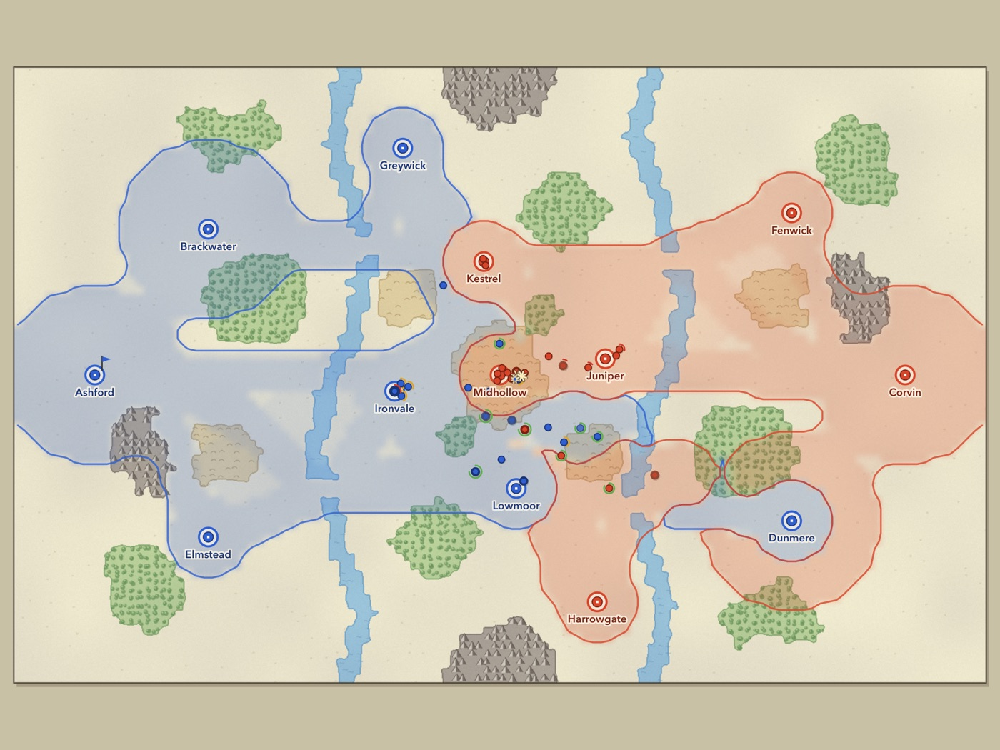

# Salient

A minimalist real-time strategy game in the browser. Armies are coloured dots,
the land belongs to whoever stands on it, and the whole game is about drawing
good front lines — and pushing them.

*Salient* (n.): a bulge in a front line that pushes into enemy territory.

**▶ Play it in your browser: https://dounodeman.github.io/Saliet/** — against the
computer, or online against a friend (click *Play with a friend* and send them the link).



## Quick start

Requires **Node.js 20+** (developed on Node 24).

```bash
npm install
npm run dev        # open the printed URL (default http://localhost:5173)
```

Other scripts:

| Command | What it does |
|---|---|
| `npm run build` | Production build into `dist/` (static files, any web server) |
| `npm run preview` | Serve the production build locally |
| `npm run typecheck` | `tsc --noEmit` over sources, tests and scripts |
| `npm test` | Vitest unit tests for the simulation and AI (~12 s) |
| `npm run balance` | Headless AI-vs-AI batches for balance passes (env: `PAIRS=hard:easy,normal:easy SEEDS=3 MAPS=twin-rivers,random`) |

Every push to `main` is type-checked, tested, built and published to GitHub
Pages by `.github/workflows/deploy.yml`.

Skip the menu with URL parameters: `?map=twin-rivers|highland-pass|random&ai=easy|normal|hard&seed=42`,
add `&spectate` to watch the AI play itself.

## How to play

Against the computer you are **Cobalt** (blue) and **Vermilion** (red) is the AI.

### Playing with a friend

1. Pick a map and click **Play with a friend**. You get a link like
   `https://dounodeman.github.io/Saliet/?join=K7M2QX`.
2. Send it to your friend. When they open it, the game starts for both of you —
   you are Cobalt, they are Vermilion. (They can also type the code on the main menu.)
3. Keep the game page open. Online games can't be paused; if one of you leaves or
   the connection drops, the computer takes over the missing player's army.
   After a game the host can start a rematch.

Connections are peer-to-peer (WebRTC). The free public PeerJS server only
introduces the two browsers; if a direct connection isn't possible it falls back
to a public relay. Very strict networks (some schools, offices or VPNs) may still
block it — try another network.

- **Cities** give you production points, and each city **supports 5 units**. Build
  more than your cities can feed and the extra units starve.
- **Territory** spreads wherever your units stand unopposed. Where the two
  armies meet, the borders run side by side — that's the front line.
- **Supply** flows from your cities through your own land. Units that are cut
  off (encircled, or deep in enemy land) are out of supply and slowly wither.
- **Light infantry** is cheap and fast and fights well in forest and hills.
  **Heavies** hit hard and soak damage on open plains but flounder anywhere
  else. Everyone is slow and weak in **water**. **Mountains** are impassable.
- Moving and fighting drain **stamina**; tired units hit softer and move
  slower. Idle, supplied units recover stamina and health.
- **Win** by holding 80% of all cities, or by destroying every enemy unit.

### Controls

| Input | Action |
|---|---|
| Left click / drag | Select a unit / box-select (Shift adds) |
| Double click | Select every visible unit of that type |
| Right click | Move — units path around mountains (Shift queues waypoints) |
| **Right drag** | **Draw a front line: the selection spreads evenly along it** (Shift queues) |
| Click a city you own | Choose where new units spawn |
| Q / E | Build light / heavy |
| H | Halt selected units |
| Ctrl+1–9, then 1–9 | Assign / recall control groups (tap twice to jump there) |
| Ctrl+A, F | Select all, centre on selection |
| Space, + / − | Pause, game speed (0.5× – 4×) |
| Wheel, WASD / arrows, screen edge, middle-drag, minimap | Zoom and pan |
| M, Esc | Mute, pause menu |

## How it's built

TypeScript + Vite + Canvas 2D, no engine. The simulation is completely
separate from rendering and input:

```
src/
  config.ts        every balance number (speeds, HP, damage, costs, terrain multipliers…)
  sim/             pure, deterministic simulation — no DOM, no Math.random
  ai/              computer opponent (sees a PlayerView, emits Commands)
  render/          Canvas 2D renderer, camera, terrain/territory layers, minimap
  input/           mouse & keyboard → selection and Commands
  ui/              HUD, menus, lobby, styles
  net/             online play: protocol, lockstep, PeerJS transport, match flow
  game/            fixed-timestep loop, match session
  maps/            hand-authored JSON maps
tests/             Vitest suites
scripts/           headless balance batches
```

- **Fixed timestep.** The sim runs at 20 ticks/s from an accumulator; the
  renderer interpolates unit positions between ticks at display frame rate.
- **Deterministic.** Seeded sfc32 RNG stored in the world, fixed iteration
  order, and only IEEE-exact arithmetic in the sim (no trig/exp/pow). A test
  scans `src/sim` for forbidden APIs, and others check that the same seed and
  commands give a bit-identical state hash — including full AI-vs-AI matches.
- **Commands are the only input.** `step(world, commands)` applies plain JSON
  commands (`move`, `line`, `halt`, `produce`, `cancel`) and logs them with
  their tick, so the log plus seed plus map is a replay — and exactly what a
  lockstep multiplayer layer would exchange.
- **Online play is deterministic lockstep.** Both browsers run the same
  simulation; a player's command is scheduled a few ticks ahead (the delay is
  picked from the measured ping), sent to the other side, and a tick only runs
  once both players' commands for it are known. The two sides compare state
  hashes every 5 seconds to catch any desync. Only commands travel over the
  network (`src/net/`), and they're checked so a player can only command their
  own army.
- **The AI plays fair.** It receives a `PlayerView` (everything on the map,
  but only its *own* production points and queue) and returns the same
  Commands a human produces. Difficulty changes reaction time and decision
  quality, not information.

### Maps

Maps are JSON files of terrain *regions* painted over a base terrain, so they
are easy to write by hand:

```json
{
  "name": "My Map", "width": 120, "height": 76, "base": "plains",
  "edgeNoise": 1.2, "symmetry": "point",
  "regions": [
    { "terrain": "forest",    "circle": [30, 28, 6] },
    { "terrain": "water",     "path": [[42, -1], [39, 10], [44, 22]], "width": 2.4 },
    { "terrain": "mountains", "polygon": [[53, 0], [67, 0], [65, 6], [58, 8]] },
    { "terrain": "hills",     "rect": [10, 10, 6, 4] }
  ],
  "cities": [{ "name": "Ashford", "x": 10, "y": 38, "owner": 0 }],
  "units":  [{ "team": 0, "type": "light", "x": 15, "y": 38 }]
}
```

Regions are applied in order (later ones win); `edgeNoise` wobbles their edges;
`"symmetry": "point"` makes the second half a 180° copy of the first for fair
maps. Register new maps in `src/maps/index.ts`. The **Random** map is generated
from a seed: fractal elevation and moisture noise, a meandering river with
fords, mirrored city pairs, and a connectivity check that carves passes if needed.

### Tuning

All numbers live in `src/config.ts`. After changing them, run
`npm run balance` to see how AI-vs-AI results shift. At the time of writing
(20 random-map games per pairing, 10 seeds × both sides, 25-minute cap):

| Pairing | Stronger AI wins | Loses | Draws | Median length |
|---|---|---|---|---|
| hard vs normal | 15 | 3 | 2 | 6.9 min |
| hard vs easy | 16 | 0 | 4 | 7.6 min |
| normal vs easy | 14 | 0 | 6 | 8.1 min |

## Working on the game with Claude on GitHub

The repo is set up for the [Claude GitHub App](https://github.com/apps/claude): write
`@claude` in an issue or pull request (e.g. *"@claude add a snow map"*) and Claude
works on it and opens a pull request; merging it redeploys the game. Only the repo
owner and collaborators can trigger it. One-time setup:

1. Install the Claude GitHub App on this repository: https://github.com/apps/claude
2. In the repo's **Settings → Secrets and variables → Actions**, add one secret:
   `CLAUDE_CODE_OAUTH_TOKEN` (run `claude setup-token` with Claude Code to use your
   Claude plan) **or** `ANTHROPIC_API_KEY` (from console.anthropic.com).

The workflow is `.github/workflows/claude.yml`; project rules for Claude are in `CLAUDE.md`.

See [PLAN.md](PLAN.md) for the design notes and decisions.
